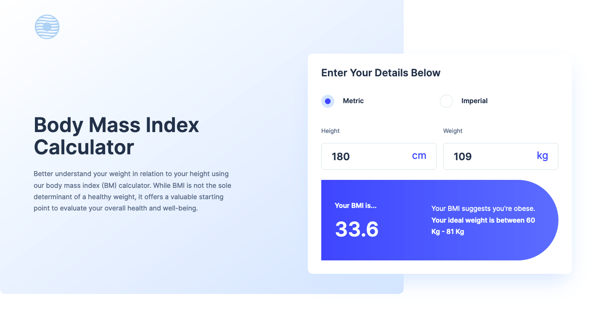

# Body Mass Index Calculator

## Table of contents

-  [Overview](#overview)
   -  [The challenge](#the-challenge)
   -  [Screenshot](#screenshot)
   -  [Links](#links)
-  [My process](#my-process)
   -  [Built with](#built-with)
   -  [What I learned](#what-i-learned)
   -  [Continued development](#continued-development)
   -  [Useful resources](#useful-resources)
-  [Author](#author)

## Overview

### The challenge

Users should be able to:

-  Select whether they want to use metric or imperial units
-  Enter their height and weight
-  See their BMI result, with their weight classification and healthy weight range
-  View the optimal layout for the interface depending on their device's screen size
-  See hover and focus states for all interactive elements on the page

### Screenshot

### Links

-  Solution URL: [Source Code](https://github.com/jacksonwhiting/bmi-landing-page)
-  Live Site URL: [Live Site](https://jw-bmi-landing.netlify.app/)

## My process

### Built with

-  Semantic HTML5 markup
-  CSS custom properties
-  Flexbox
-  CSS Grid
-  Mobile-first workflow
-  Tailwind CSS
-  Vanilla Javascript

### What I learned

The desktop header / form gave me problems at first converting it to mobile. I think it's best with a complex desktop layout to try to construct the layout first (very basically) and then make sure the mobile layout will allow for the desktop layout.

I strive for a mobile first design and workflow, but I had to go back and make changes to my mobile layout beacuse it wouldn't accomodate the desktop layout.

### Continued development

I'd like to continue working on simplifying the javascript to make the functions easier to read and easier to understand.

### Useful resources

## Author

-  Frontend Mentor - [@jacksonwhiting](https://www.frontendmentor.io/profile/jacksonwhiting)
-  Twitter - [@JWhiting00](https://www.twitter.com/JWhiting0)
